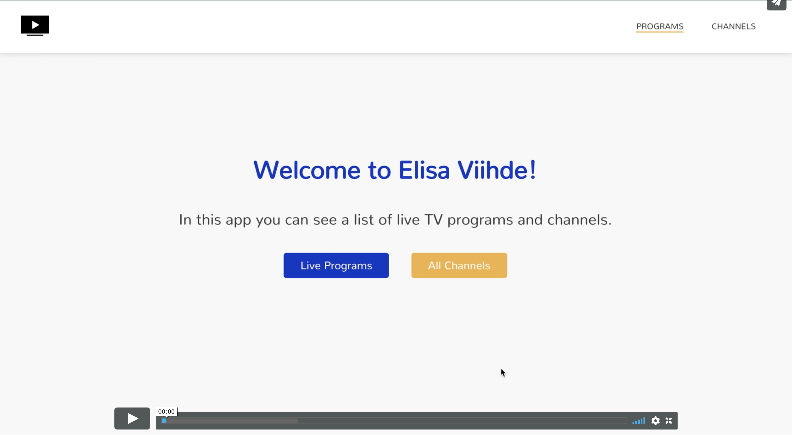

## Description

The app shows a list of live programs and channels in different pages.
The programs adn channels are fetched using the API provided by Eliisa Viihde.
Each program and channel has its descripton.

## Demo link

[Open Demo Version](https://utilizeapi.netlify.com/)

## Video demo

## Technologies and tools used

- JavaSctipt
  - React
  - Jest testing framework
- HTML
- CSS
  - Sass
- Netlify

## How to get locally

- git clone https://github.com/AnyaSen/Challenge-utilize-api.git
- npm install

## How to run tests

- npm run test
